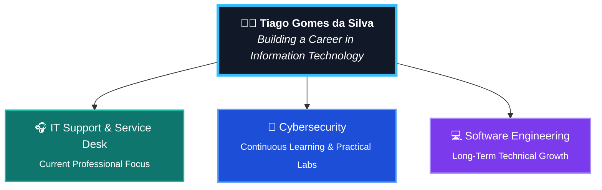

# Olá, eu sou o Tiago 👋

🔧 **IT Support Analyst** | Help Desk · Service Desk N1/N2 · Windows · Redes  
🛡️ **Em transição para Cybersecurity & SOC** | Blue Team · SIEM · Active Directory

Atuo há 3 anos em Suporte Técnico e hoje construo, de forma pública e 
documentada, minha trilha de estudos em Segurança da Informação — unindo 
prática hands-on (TryHackMe, laboratórios em Kali Linux) com formação 
acadêmica (Pós-graduação em Cibersegurança, UniÚnica, conclusão prevista 
dez/2026).

Também tenho formação em Engenharia de Software e aplico conhecimentos de 
programação (Python, lógica de scripting) como diferencial para automação, 
análise de código e apoio técnico em Segurança da Informação.

---

### 🎯 Objetivo
SOC Analyst N1 · Junior Cybersecurity Analyst · Information Security Analyst

### 📂 Meus repositórios de jornada

- 🛡️ [`cybersecurity-journey`](https://github.com/TiagoSilva00/cybersecurity-journey) — Estudos em Segurança da Informação, documentados semana a semana
- 🎧 [`suporte-tecnico-journey`](https://github.com/TiagoSilva00/suporte-tecnico-journey) — Prática e documentação em Suporte Técnico / Help Desk
- 💻 [`programming-journey`](https://github.com/TiagoSilva00/programming-journey) — Lógica de programação aplicada a automação e apoio à segurança

### 🧰 Stack & Ferramentas

### 📈 Status atual

## 🗺️ Professional Career Roadmap

### 🔗 Conecte-se comigo

